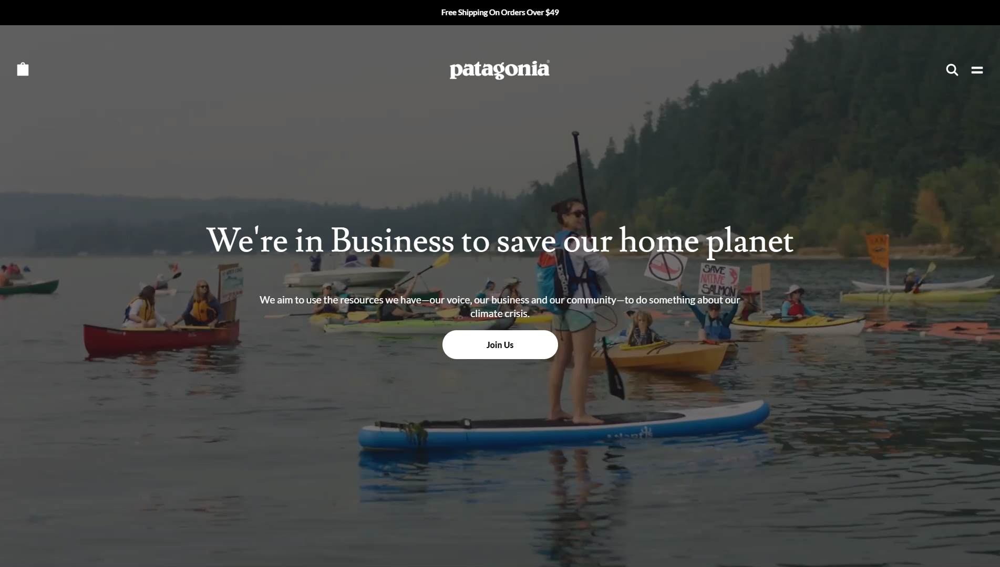
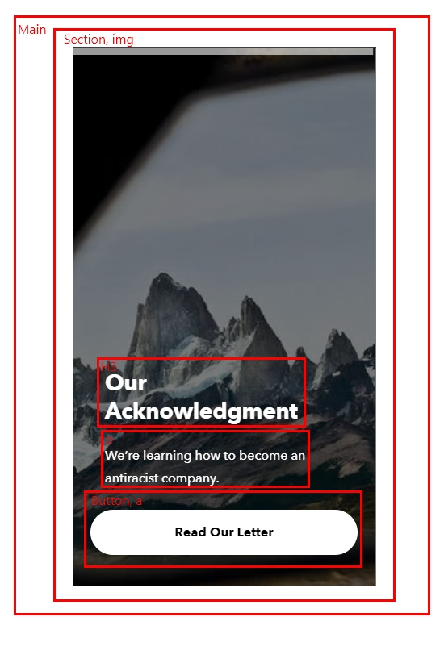

# Procesverslag
**Auteur:** Julius Meeuwisse

Markdown cheat cheet: [Hulp bij het schrijven van Markdown](https://github.com/adam-p/markdown-here/wiki/Markdown-Cheatsheet). Nb. de standaardstructuur en de spartaanse opmaak zijn helemaal prima. Het gaat om de inhoud van je procesverslag. Besteedt de tijd voor pracht en praal aan je website.

## Bronnenlijst
1. -bron 1-
2. -bron 2-
3. -...-

## Eindgesprek (week 7/8)

Ik vondt het gebruik van nth of type en first of type erg lastig, en heb nog steeds teveel classes gebruikt. Ik vond uiteindelijk de sliders maken erg leuk en het verbaaste me hoe het in zijn werking ging. Ook vond ik het nog steeds lastig om te kiezen welk soort element ik moet kiezen zodat de website semantisch correct blijft. Ik ben uiteindelijk best tevreden met mijn ontwerp maar denk dat de code veel beter kan.

**Screenshot(s):**

-screenshot(s) van je eindresultaat-

## Voortgang 3 (week 6)

Veder gegaan aan de sliders en klein beetje aan pagina 2 gewerkt.
Ik heb deze slider gemaakt wat erg lastig was voor mijn gevoel maar uiteindelijk toch prima gelukt is.
Ook heb ik deze week een goed begin gemaakt aan de footer.

## Voortgang 2 (week 5)

Ik heb de sliders helemaal anders gemaakt zodat ze nu echt goed werken en heb veel content toegevoegd.

**Screenshot(s):**

## Voortgang 1 (week 3)

Het was deze week erg druk maar ben toch blij met de voortgang die ik heb gemaakt,
vooral de sliders had ik problemen mee en eerst de flexbox maar heb dit ondertussen allemaal gefixed.

**Screenshot(s):**

### Agenda voor meeting

-samen met je groepje opstellen-

| student 1      | student 2          | student 3    | student 4        |
| ---            | ---                | ---          | ---              |
| dit bespreken  | en dit             | en ik dit    | en dan ik dat    |
| an dat ook nog | dit als er tijd is | nog een punt | dit wil ik zeker |
| ...            | ...                | ...          | ...              |

### Verslag van meeting

-na afloop snel uitkomsten vastleggen-

## Breakdownschets (week 1)

## Intake (week 1)

**Je startniveau:** Rood

**Je focus:** Responsive

**Je opdracht:** https://www.patagonia.com/home/

**Screenshot(s) van de eerste pagina (small screen):**

**Screenshot(s) van de tweede pagina (small screen):**

